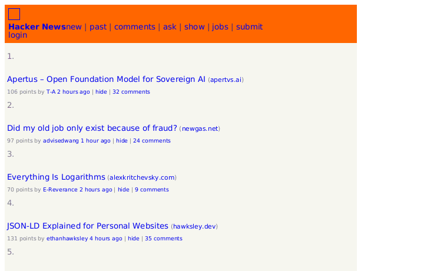
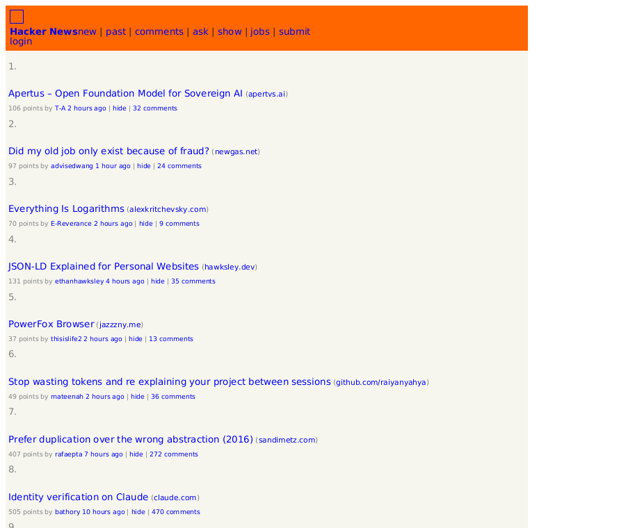
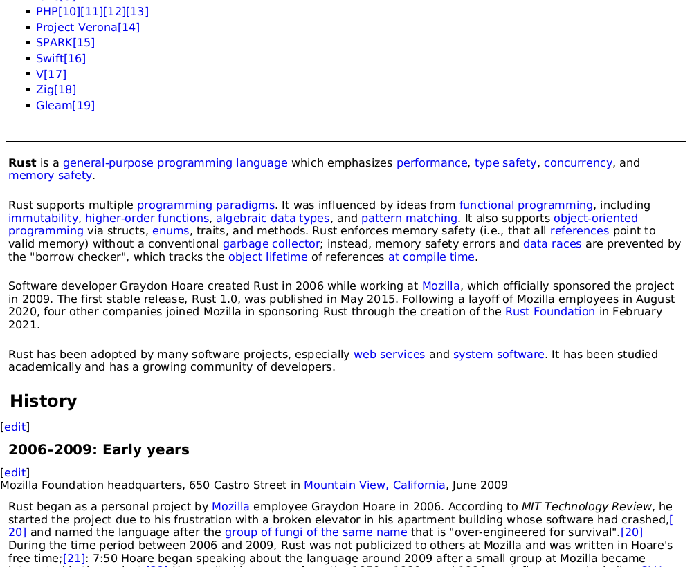
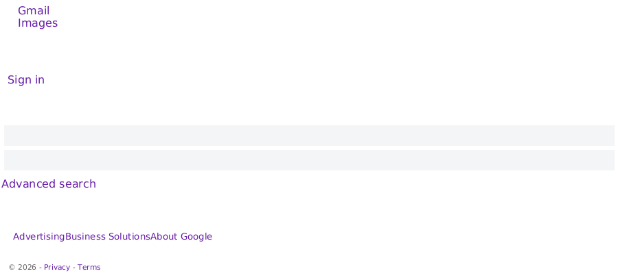

# 🐦 Robin — build a web browser engine from scratch in Rust

> A tiny, readable browser **engine** — not a Chromium or WebKit wrapper. Every
> stage that turns bytes on the wire into pixels on the screen is implemented
> here in plain Rust, one commit at a time, so you can learn how browsers (and
> Rust) actually work.

<p align="center">
  
</p>

Robin is a modern, from-scratch reimagining of the classic
[*Intro to Rust: building a browser engine*](https://steemit.com/utopianio/@tensor/intro-to-rust-building-a-browser-engine-dom-and-html-parser)
tutorial (itself inspired by Matt Brubeck's *Let's build a browser engine!* /
**robinson** — hence the name **Robin**). The original is wonderful but now
abandoned and outdated; this repo brings the same idea up to modern Rust, makes
it render *real* pages, and is built to be **agent-first** so you can point a
coding agent at it and learn by doing.

## It renders real pages

No JavaScript, no flexbox, no GPU — just a parser, a cascade, a layout engine and
a software rasterizer, all hand-written. Yet it's enough to read the web:

| Hacker News | Wikipedia | Google (no-JS) |
| :---------: | :-------: | :------------: |
|  |  |  |

*(These are rendered from the offline snapshots in [`assets/snapshots/`](assets/snapshots);
regenerate them with [`scripts/render-demos.sh`](scripts/render-demos.sh). The
Wikipedia shot is the article body — see [chapter 12](docs/12-limitations-and-next-steps.md)
for why the nav stacks on top without `float` support.)*

## What it does

- Parses **real HTML** into a DOM — tolerant of the messy markup real sites ship
- Parses **CSS** — selectors, the cascade, specificity, inheritance
- Builds a **layout tree** — the box model, block + inline flow, text wrapping
- **Paints** to a pixel buffer and saves a **PNG**, or opens a **scrollable window**
- Rasterizes **anti-aliased text** with bundled fonts (no system fonts needed)
- **Fetches** pages over HTTPS, from local files, or from bundled offline snapshots

It is deliberately small and has real limits (no JavaScript, no flexbox/grid, no
incremental layout). Those limits are the *point* —
see [`docs/12-limitations-and-next-steps.md`](docs/12-limitations-and-next-steps.md).

## Quick start

You need a recent Rust toolchain ([rustup.rs](https://rustup.rs)). Then:

```bash
# Render a bundled snapshot of Hacker News to a PNG (no network needed)
cargo run --release -- assets/snapshots/hackernews.html --png out/hn.png

# Render a live page over HTTPS
cargo run --release -- https://example.com --png out/example.png

# Open an interactive, scrollable window
cargo run --release -- assets/snapshots/wikipedia.html --window
```

Handy flags: `--dump-dom` and `--dump-layout` print the tree at that stage,
`--width <px>` sets the viewport width, and `--clip-top`/`--clip-height` crop the
PNG to one band of a tall page. Run `cargo run -- --help` for all of them.

## Learn it commit by commit

This repo's **git history is the tutorial**. Each commit adds exactly one idea,
and each maps to a chapter in [`docs/`](docs/):

```bash
git log --oneline --reverse   # walk the whole pipeline, one concept at a time
```

| # | Chapter | Module |
| - | ------- | ------ |
| 0 | [How to use this repo](docs/00-how-to-use-this-repo.md) | — |
| 1 | [The DOM](docs/01-the-dom.md) | [`dom.rs`](src/dom.rs) |
| 2 | [The HTML parser](docs/02-html-parser.md) | [`html.rs`](src/html.rs) |
| 3 | [The CSS parser](docs/03-css-parser.md) | [`css.rs`](src/css.rs) |
| 4 | [Style & the cascade](docs/04-style-and-the-cascade.md) | [`style.rs`](src/style.rs) |
| 5 | [Block layout](docs/05-block-layout.md) | [`layout.rs`](src/layout.rs) |
| 6 | [Painting](docs/06-painting.md) | [`paint.rs`](src/paint.rs), [`render.rs`](src/render.rs) |
| 7 | [Text rasterization](docs/07-text-rasterization.md) | [`text.rs`](src/text.rs) |
| 8 | [Inline layout & text flow](docs/08-inline-layout-and-text.md) | [`layout.rs`](src/layout.rs) |
| 9 | [Networking](docs/09-networking.md) | [`net.rs`](src/net.rs) |
| 10 | [The interactive window](docs/10-interactive-window.md) | [`window.rs`](src/window.rs) |
| 11 | [Rendering real pages](docs/11-rendering-real-pages.md) | (the messy-web fixes) |
| 12 | [Limitations & next steps](docs/12-limitations-and-next-steps.md) | — |

Every chapter ends with **exercises** that extend that stage — that's where the
real learning happens. Run a single stage's tests with e.g. `cargo test layout`.

## Built to learn *with an agent*

Robin is **agent-first**. Point a coding agent (Claude Code, Cursor, …) at this
repo and it has everything it needs to teach you, not just to dump answers:

- [`AGENTS.md`](AGENTS.md) / [`CLAUDE.md`](CLAUDE.md) — a codebase map, the
  build/test commands, conventions, and explicit guidance to **coach** you
- [`docs/`](docs/) — a chapter per stage, with graded exercises
- A clean module-per-stage layout and per-module tests you can run one at a time

A good first prompt: *"I'm learning Rust. Walk me through `src/dom.rs`, then give
me exercise 1 from `docs/01-the-dom.md` and review my attempt."*

## How it's built

Pure standard library for the core stages (DOM, HTML, CSS, style, layout); each
remaining stage adds exactly one focused crate, exactly when it's first needed:

| Crate | Used for | First appears in |
| ----- | -------- | ---------------- |
| [`image`](https://crates.io/crates/image) | PNG output (codec only) | painting |
| [`fontdue`](https://crates.io/crates/fontdue) | glyph rasterization | text |
| [`ureq`](https://crates.io/crates/ureq) + [`url`](https://crates.io/crates/url) | HTTPS fetch + URL resolution | networking |
| [`minifb`](https://crates.io/crates/minifb) | the interactive window | window |

## License

MIT for the code (see [`LICENSE`](LICENSE)); the bundled DejaVu fonts are under
their own permissive license (see [`assets/fonts/FONT-LICENSE.txt`](assets/fonts/FONT-LICENSE.txt)).

Inspired by [tensor-programming's original tutorial](https://github.com/tensor-programming/rust_browser_part_1)
and Matt Brubeck's [robinson](https://limpet.net/mbrubeck/2014/08/08/toy-layout-engine-1.html).
